# 🥕 FarmBasket - Bridging Farmers and Consumers 🌾

**Live App:** [efarming-1.onrender.com](https://efarming-1.onrender.com)

FarmBasket is a full-stack web application that connects **farmers directly to buyers**, eliminating middlemen. Built with modern tech for a seamless and transparent food supply experience.

---

## 🚀 Features

- 👨‍🌾 Farmer Login, View & Add Products  
- 🛒 Buyer Login, Purchase & Order Tracking  
- 🛡 Admin Panel for system-wide monitoring  
- 💳 Razorpay Integration for Secure Payments  
- 🗄 Online & Offline Database Support (MySQL via Railway & Localhost)
- ☁ Hosted frontend + backend using Render

---

## 🔐 Authentication Pages

### 🏠 Sign In / Sign Up
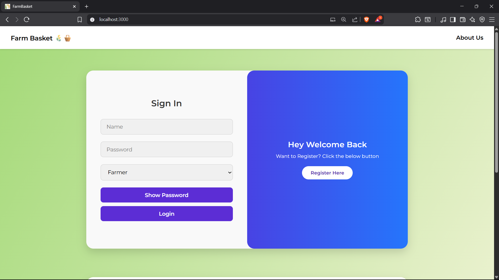
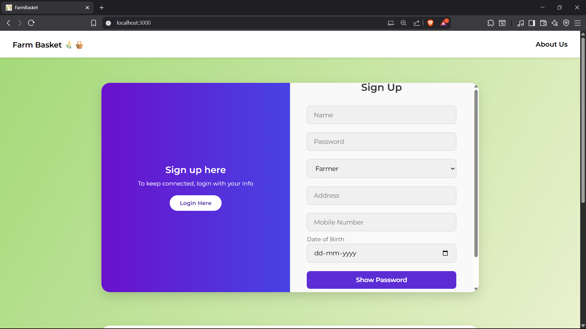

---

## ℹ️ About Us
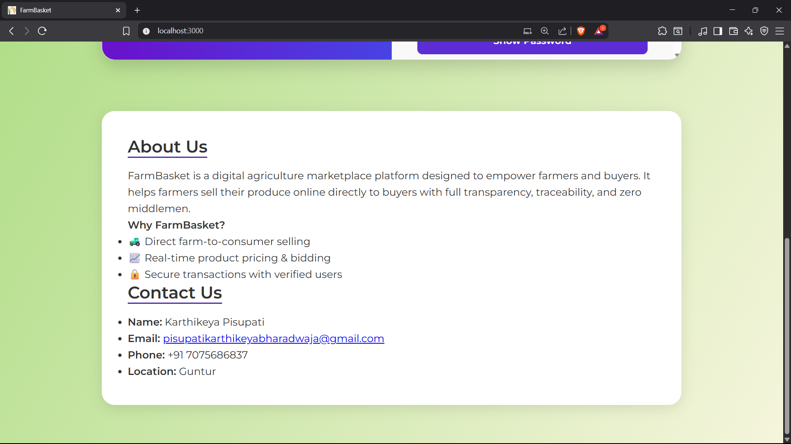

---

## 👨‍🌾 Farmer Portal

### 📋 View Product Listings
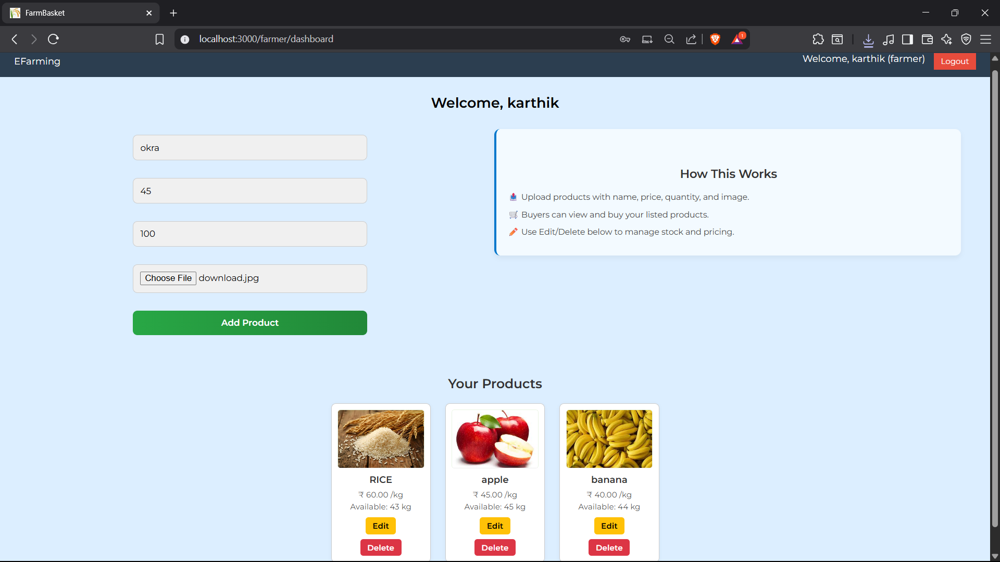

### ➕ Add New Product
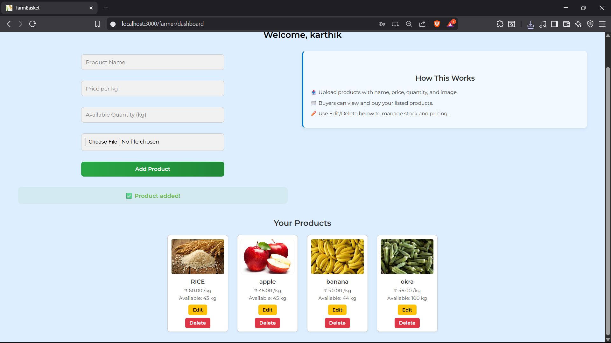

---

## 🧑‍🤝‍🧑 Buyer Portal

### 🛒 Buyer Dashboard
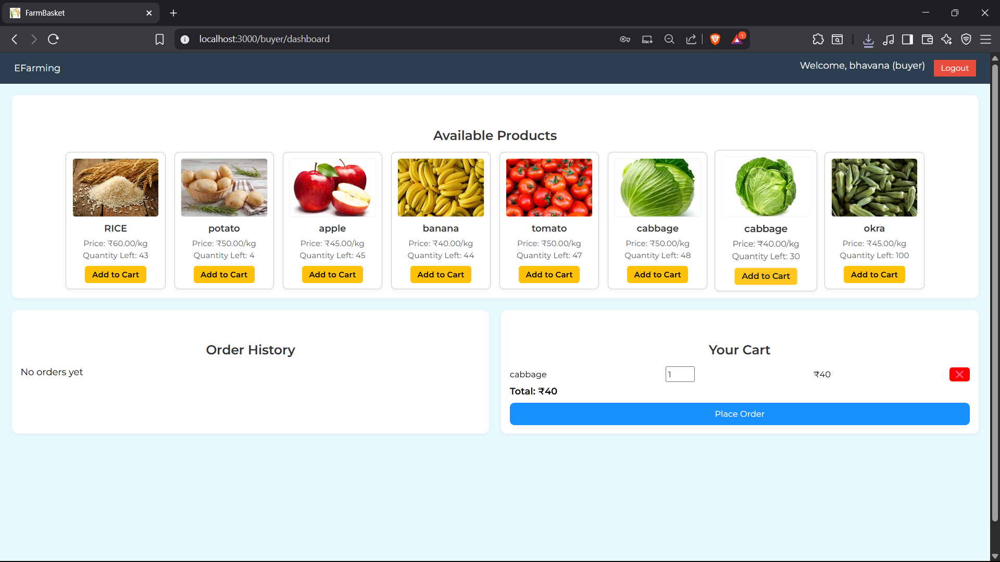

### 💰 Payment & Delivery Tracking
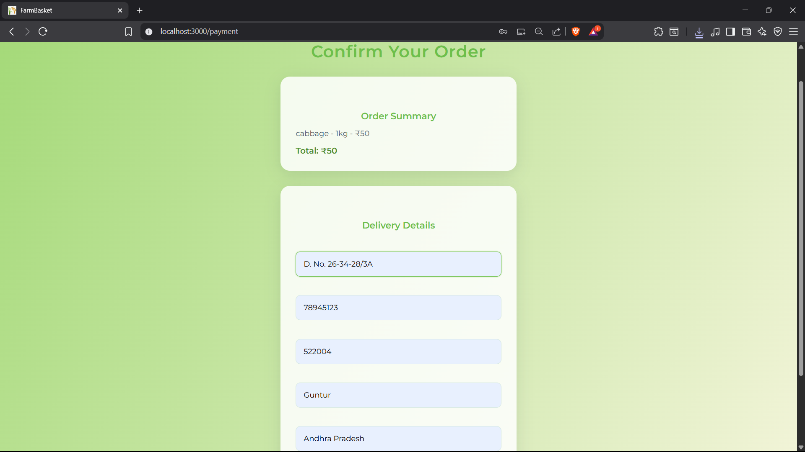

---

## 💳 Payment Integration
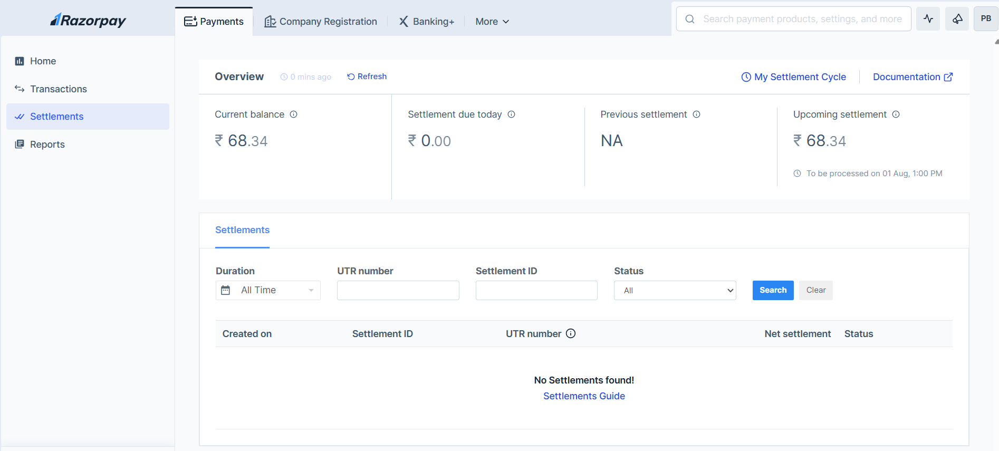

---

## 🔐 Admin Panel

### 👁 View All Activity (Farmers, Buyers, Products, Orders)
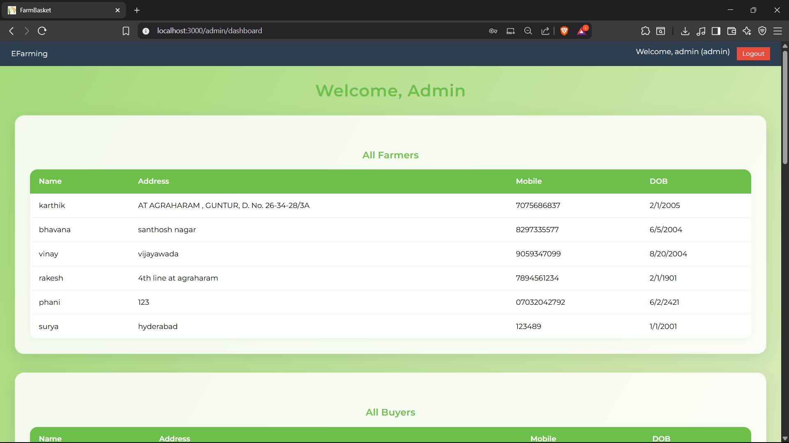
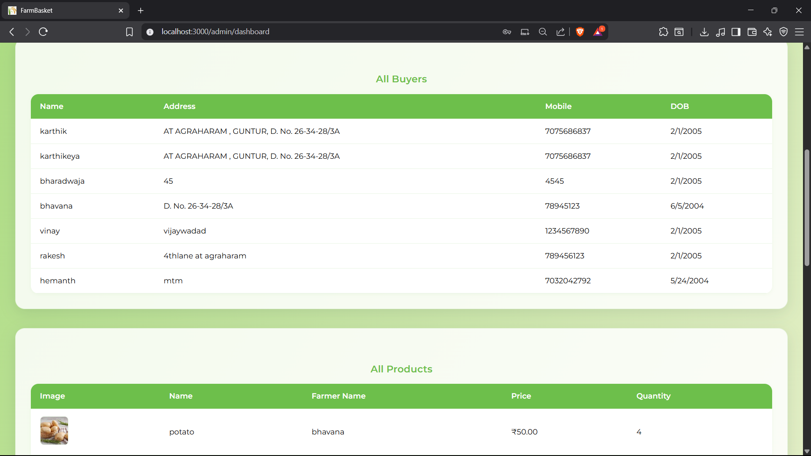
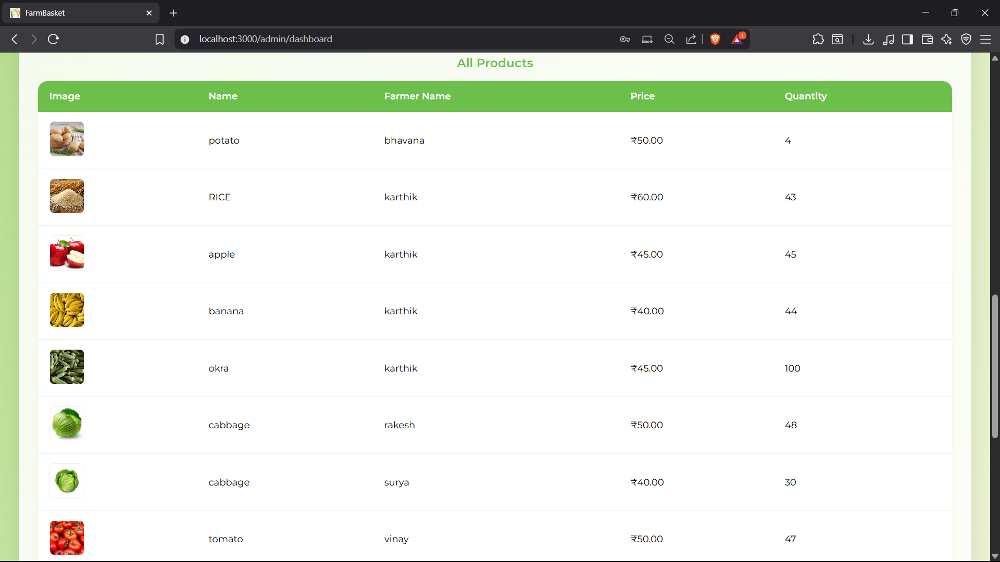
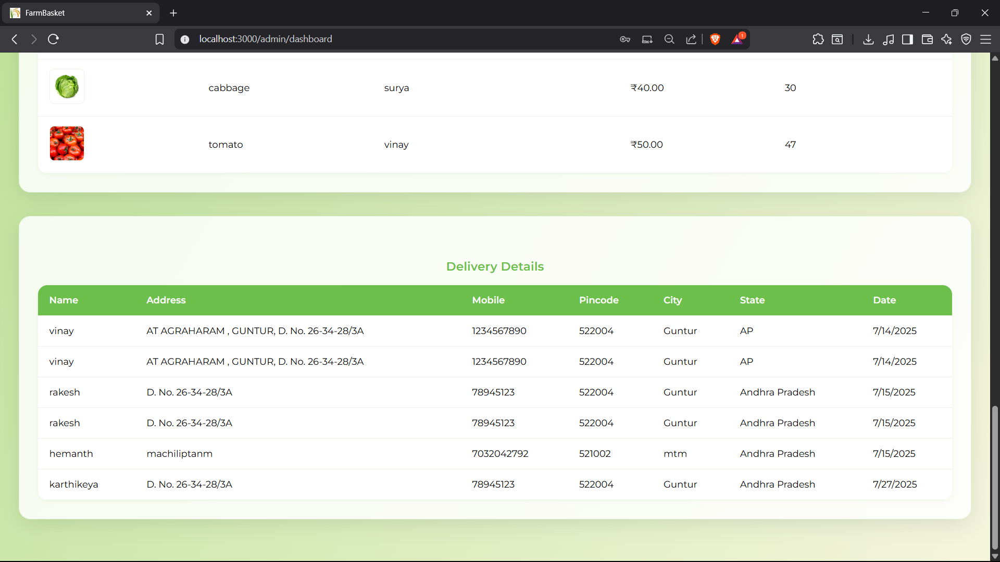

---

## 🗃 Database & Deployment

### 🧪 Local SQL Connection
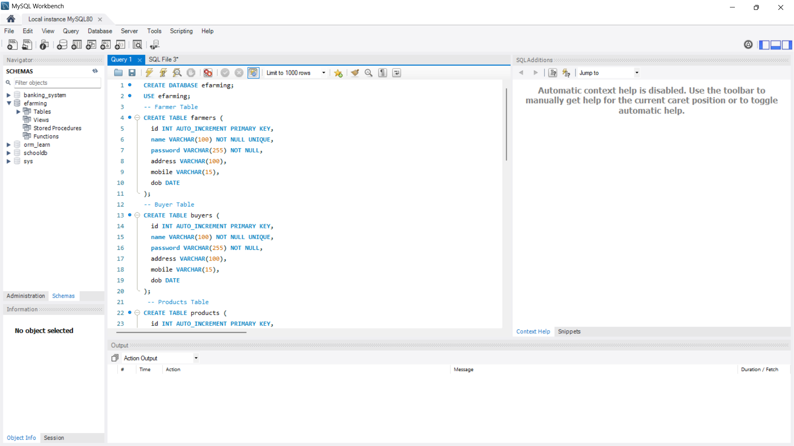

### ☁ Deployment via Render (Backend + Frontend)
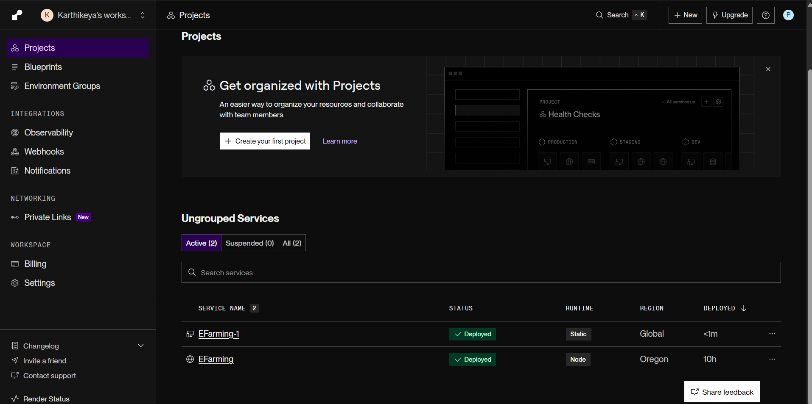

### 🧵 Cloud SQL using Railway
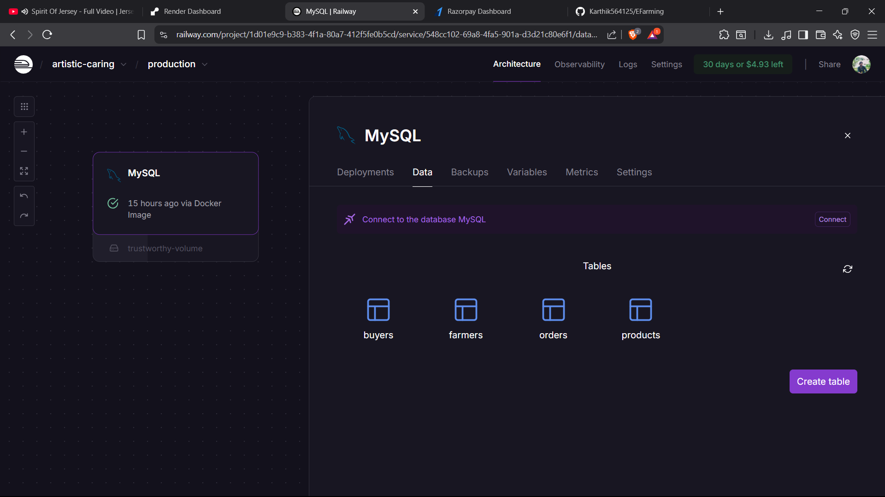

---

## 🛠️ Tech Stack

- **Frontend:** React.js, HTML, CSS, JS
- **Backend:** Node.js
- **Database:** MySQL (Railway & Localhost)
- **Payments:** Razorpay
- **Hosting:** Render

> © 2025 FarmBasket — Cultivating Connections Between Farmers and Buyers
